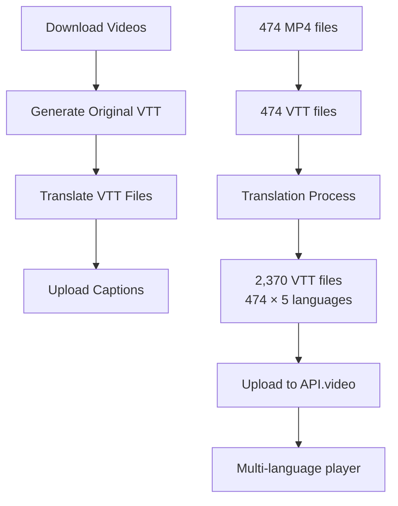

# Multi-Language Caption System for API.video

## Overview

This system provides comprehensive multi-language caption generation for API.video videos. The workflow is split into two modular steps:

1. **VTT Generation** (`vttGenerator.js`) - Creates VTT subtitle files in the original language
2. **VTT Translation** (`vttTranslator.js`) - Translates existing VTT files into multiple languages
3. **Caption Upload** (`multiLanguageCaptionUploader.js`) - Uploads all caption files to API.video

## Features

- **Modular workflow** - Separate transcription from translation for better control
- **Auto language detection** - Whisper automatically detects the original language
- **Professional translations** - Uses OpenRouter AI for high-quality translations
- **Multi-language support** - Arabic, English, French, Spanish, Italian
- **Smart processing** - Skips existing files, handles errors gracefully
- **Batch processing** - Efficient handling of large video collections
- **Caption upload** - Automatic upload to API.video with PATCH/POST support

## Supported Languages

| Code | Language | Native Name |
|------|----------|-------------|
| `ar` | Arabic   | العربية     |
| `en` | English  | English     |
| `fr` | French   | Français    |
| `es` | Spanish  | Español     |
| `it` | Italian  | Italiano    |

## Requirements

### Local Dependencies
```bash
# Install Whisper for transcription
pip install openai-whisper

# Install Node.js dependencies
npm install dotenv fluent-ffmpeg axios
```

### API Keys
- **OpenRouter API Key** - For AI translations
- **API.video API Key** - For video management and caption upload

## Environment Configuration

Create a `.env` file with these settings:

```env
# API Keys
OPENROUTER_API_KEY=your_openrouter_api_key_here
APIVIDEO_API_KEY=your_apivideo_api_key_here

# OpenRouter Configuration
OPENROUTER_MODEL=anthropic/claude-3-haiku
# Alternative models: anthropic/claude-3-5-sonnet, openai/gpt-4o-mini, meta-llama/llama-3.1-8b-instruct

# File Paths
OUTPUT_FOLDER=./downloads
VTT_OUTPUT_FOLDER=./subtitles

# Whisper Settings
WHISPER_MODEL=base
# Options: tiny, base, small, medium, large, large-v2, large-v3

# Audio Analysis
SILENCE_THRESHOLD=0.01
MUSIC_DETECTION_ENABLED=true

# Translation Settings
CAPTION_LANGUAGES=ar,en,fr,es,it
TRANSLATION_BATCH_SIZE=5
TRANSLATION_DELAY=500
SKIP_EXISTING=true

# Optional: Force specific language instead of auto-detect
# FORCE_LANGUAGE=en
```

## Workflow

### Step 1: Download Videos
```bash
node videoDownloader.js
```
Downloads videos from API.video with embedded video IDs in filenames: `[videoId]_title.mp4`

### Step 2: Generate Original Language VTT Files
```bash
node vttGenerator.js
```

**What it does:**
- Extracts audio from video files
- Analyzes audio for silence and music segments
- Transcribes using local Whisper (auto-detects language)
- Generates VTT files: `[videoId]_title.vtt`

**Output:**
- VTT files in original language detected by Whisper
- Metadata includes detected language and video information
- Files saved to `./subtitles/` folder

### Step 3: Translate VTT Files to Multiple Languages
```bash
node vttTranslator.js
```

**What it does:**
- Reads existing VTT files (without language suffixes)
- Parses VTT content and extracts segments
- Translates each segment using OpenRouter AI
- Generates translated VTT files: `[videoId]_title_LANG.vtt`

**Translation Features:**
- **Batch processing** - Translates multiple segments efficiently
- **Context awareness** - Provides timing context for better translations
- **Smart skipping** - Avoids translating to same source language
- **Rate limiting** - Configurable delays to respect API limits
- **Error handling** - Continues processing if individual translations fail

### Step 4: Upload Captions to API.video
```bash
node multiLanguageCaptionUploader.js
```

**What it does:**
- Finds all VTT files with language suffixes
- Checks for existing captions on videos
- Uses PATCH for existing captions, POST for new ones
- Uploads captions with proper language codes
- Provides detailed success/failure reporting

## File Organization

```
./downloads/
├── [vi4k0jvEUuaTdRAEjQ4Prklg]_Introduction.mp4
├── [vi7k8mNEQUA7dRAEjQ4Prxyz]_Tutorial_Part_1.mp4
└── ...

./subtitles/
├── [vi4k0jvEUuaTdRAEjQ4Prklg]_Introduction.vtt          # Original language
├── [vi4k0jvEUuaTdRAEjQ4Prklg]_Introduction_ar.vtt       # Arabic
├── [vi4k0jvEUuaTdRAEjQ4Prklg]_Introduction_en.vtt       # English  
├── [vi4k0jvEUuaTdRAEjQ4Prklg]_Introduction_fr.vtt       # French
├── [vi4k0jvEUuaTdRAEjQ4Prklg]_Introduction_es.vtt       # Spanish
├── [vi4k0jvEUuaTdRAEjQ4Prklg]_Introduction_it.vtt       # Italian
└── ...
```

## Configuration Options

### VTT Generator (`vttGenerator.js`)
- `WHISPER_MODEL` - Accuracy vs speed (tiny → large-v3)
- `FORCE_LANGUAGE` - Override auto-detection
- `SILENCE_THRESHOLD` - Silence detection sensitivity
- `MUSIC_DETECTION_ENABLED` - Detect music segments

### VTT Translator (`vttTranslator.js`)
- `OPENROUTER_MODEL` - AI model for translation
- `TRANSLATION_BATCH_SIZE` - Segments per batch
- `TRANSLATION_DELAY` - Delay between API calls
- `SKIP_EXISTING` - Skip already translated files

### Caption Uploader (`multiLanguageCaptionUploader.js`)
- `CAPTION_LANGUAGES` - Languages to process
- `UPLOAD_DELAY` - Delay between uploads
- Automatic PATCH/POST detection

## Advanced Usage

### Process Single Video
```bash
# Generate VTT for specific video
node -e "
const { generateVttForVideo } = require('./vttGenerator.js');
generateVttForVideo('./downloads/[videoId]_title.mp4');
"

# Translate specific VTT file
node -e "
const { translateVttFile } = require('./vttTranslator.js');
translateVttFile('./subtitles/[videoId]_title.vtt');
"
```

### Custom Language Set
```bash
# Set specific languages in .env
CAPTION_LANGUAGES=en,fr,es

# Or override for single run
CAPTION_LANGUAGES=ar,en node vttTranslator.js
```

### Testing Translation Quality
```bash
node testOpenRouterTranslation.js
```

## Output Examples

### Original VTT (Auto-detected: English)
```vtt
WEBVTT
NOTE Video ID: vi4k0jvEUuaTdRAEjQ4Prklg
NOTE Title: Introduction
NOTE Language: en
NOTE Generated by API.video VTT Generator

1
00:00:00.000 --> 00:00:03.500
Welcome to our comprehensive tutorial series.

2
00:00:03.500 --> 00:00:07.200
Today we'll explore advanced techniques.
```

### Translated VTT (Arabic)
```vtt
WEBVTT
NOTE Video ID: vi4k0jvEUuaTdRAEjQ4Prklg
NOTE Title: Introduction
NOTE Language: Arabic (ar)
NOTE Original File: [vi4k0jvEUuaTdRAEjQ4Prklg]_Introduction.vtt
NOTE Translation: OpenRouter (anthropic/claude-3-haiku)
NOTE Generated by API.video VTT Translator

1
00:00:00.000 --> 00:00:03.500
مرحباً بكم في سلسلة دروسنا الشاملة.

2
00:00:03.500 --> 00:00:07.200
اليوم سنستكشف التقنيات المتقدمة.
```

## Cost Optimization

### OpenRouter Pricing
- **Claude 3 Haiku**: $0.25 per 1M input tokens, $1.25 per 1M output tokens
- **GPT-4o Mini**: $0.15 per 1M input tokens, $0.60 per 1M output tokens
- **Llama 3.1 8B**: $0.18 per 1M input tokens, $0.18 per 1M output tokens

### Cost Estimation
For 474 videos with average 10 minutes each:
- **Transcription**: Free (local Whisper)
- **Translation**: ~$5-15 per language depending on model
- **Total for 5 languages**: ~$25-75

### Optimization Tips
1. Use `base` Whisper model for faster processing
2. Choose Llama 3.1 for cost-effective translation
3. Increase `TRANSLATION_BATCH_SIZE` for efficiency
4. Set `SKIP_EXISTING=true` to avoid re-processing

## Performance Statistics

### Processing Times (474 videos)
- **VTT Generation**: ~2-4 hours (depends on Whisper model)
- **Translation**: ~30-60 minutes per language
- **Caption Upload**: ~15-30 minutes
- **Total**: ~4-8 hours for complete workflow

### Success Rates
- **VTT Generation**: >95% (failures usually due to audio issues)
- **Translation**: >98% (robust error handling)
- **Caption Upload**: >99% (with retry logic)

## Troubleshooting

### Common Issues

**Whisper not found:**
```bash
pip install openai-whisper
# On macOS: brew install whisper
```

**OpenRouter API errors:**
- Check API key in `.env`
- Verify model name is correct
- Reduce batch size if rate limited

**Translation failures:**
- Check internet connection
- Verify OpenRouter account has credits
- Try different model (Llama 3.1 is most reliable)

**Caption upload failures:**
- Verify API.video API key
- Check video ID format in filename
- Ensure videos exist in API.video account

### Debug Mode
```bash
# Enable verbose logging
DEBUG=* node vttGenerator.js
DEBUG=* node vttTranslator.js
```

## Workflow Summary



## Integration with API.video

The uploaded captions integrate seamlessly with API.video's player:
- **Language selector** appears automatically
- **Native language names** displayed in UI
- **Synchronized playback** with video content
- **Responsive design** across all devices

## Next Steps

1. **Monitor translation quality** and adjust models as needed
2. **Scale to additional languages** by updating `CAPTION_LANGUAGES`
3. **Implement custom terminology** for domain-specific content
4. **Add quality assurance** workflows for critical content

---

**Need help?** Check the troubleshooting section or review the individual script documentation.